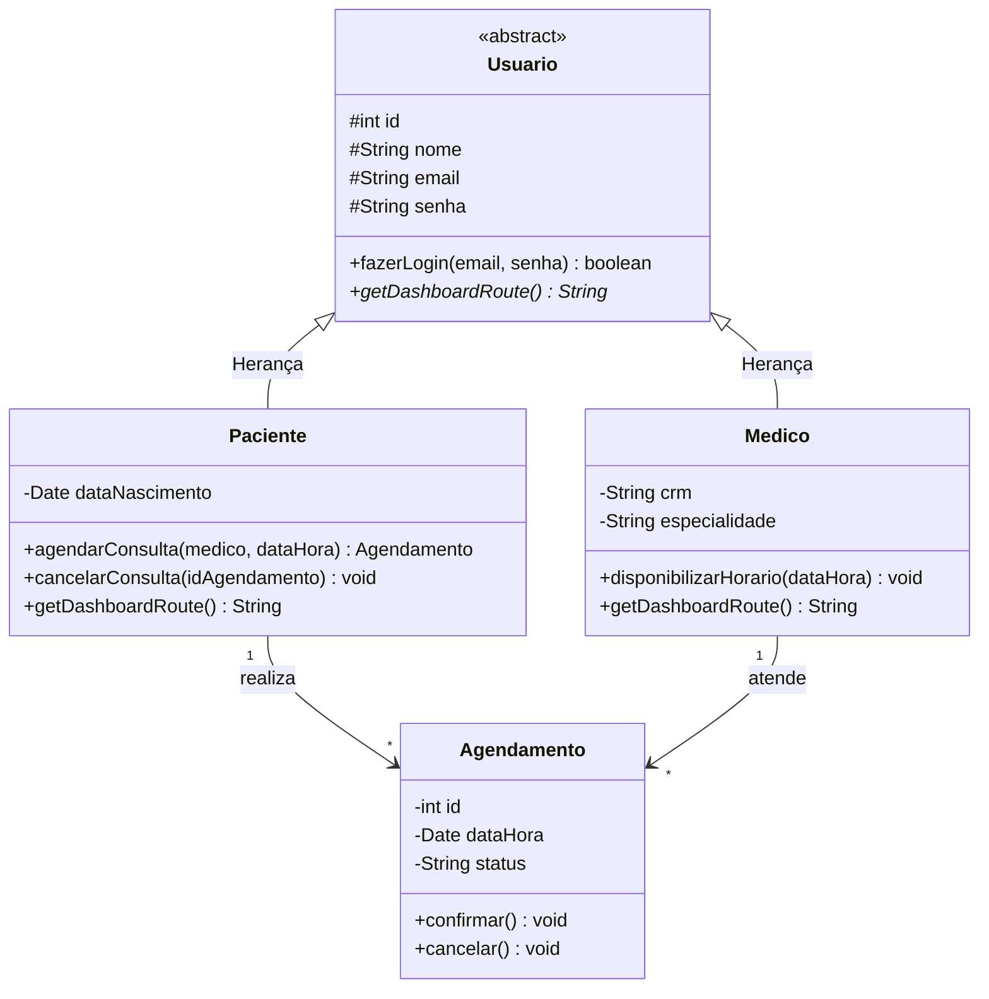
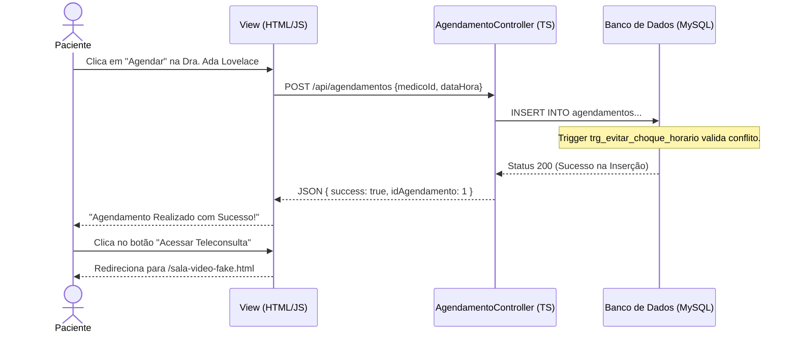

# 📊 Diagramas UML e Fluxos (Eng. de Software II)

Os diagramas abaixo servem para validar a integração entre Back-End, Front-End e Banco de Dados e compõem o Projeto Interdisciplinar.

## 1. Diagrama de Classes (Lógica Orientada a Objetos)
Estrutura refletindo a implementação do TypeScript (MVC / Entidades).

## 2. Diagrama de Sequência: CRUD de Agendamento
Mapeamento do fluxo onde o Paciente escolhe um médico fake no Front-End e realiza a reserva, terminando na página de vídeo simulada.

