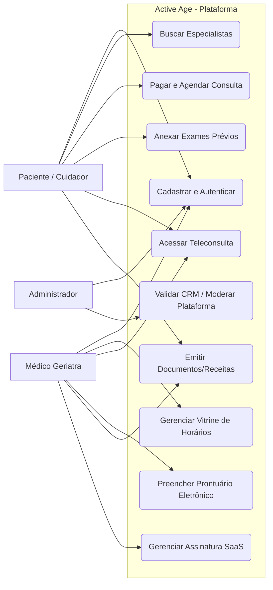
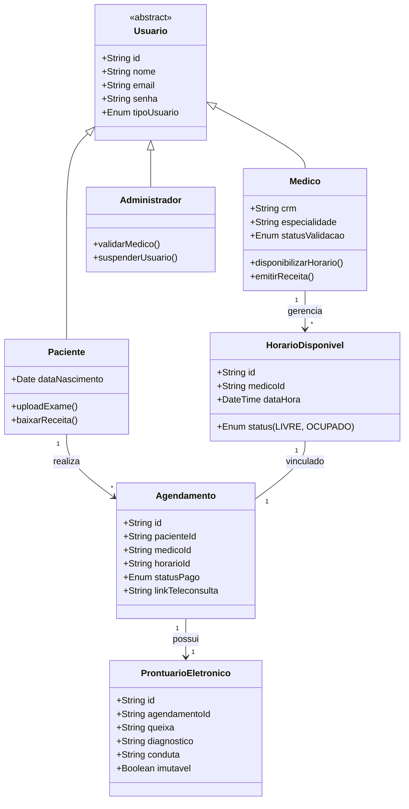
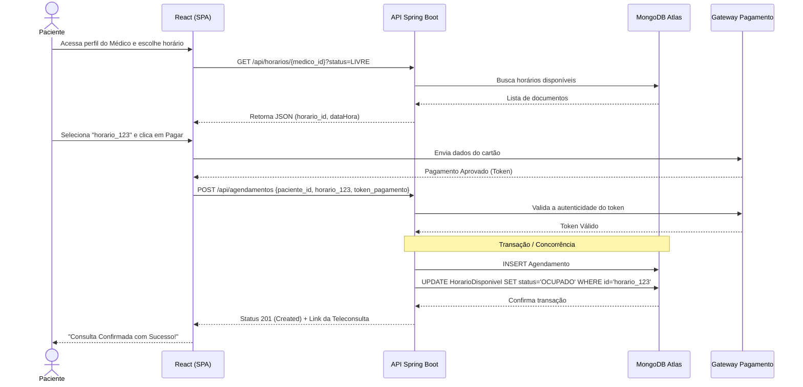

# 📐 Modelos UML e Fluxos do Sistema

Para guiar o desenvolvimento das APIs e das interfaces, a arquitetura do **Active Age** foi modelada utilizando a notação UML (Linguagem de Modelagem Unificada).

## 1. Diagrama de Casos de Uso (Visão Geral)
Mapeamento das interações dos usuários com os módulos do sistema.

## 2. Diagrama de Classes (Entidades de Domínio)
O mapeamento das coleções que irão residir no MongoDB. O uso de Herança simplifica o gerenciamento de usuários.

## 3. Diagrama de Sequência: Fluxo de Agendamento Seguro
Fluxo que demonstra a inteligência de negócios ao cruzar a **Vitrine de Horários** com a **Efetivação por Pagamento** para garantir a segurança da reserva.

